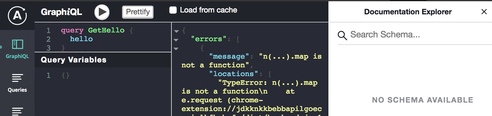
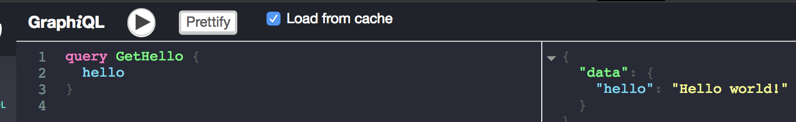

# Apollo Tooling Example

This is a simple example of a websocket link only
client. Currently Apollo Dev tools doesn't work in this
configuration. The notable problems and observations are as follows:

1.  The dev tools won't get the schema or be able to query. 

1.  Queries can be made if the checkbox to only query
    the cache is checked 

1.  The whole chrome dev tools panel must be restarted
    on every code refresh. This is troublesome in development, the primary use case for such tooling.

1.  By simply switching to an HTTP link, or presumably,
    by only useing the ws link for subscription, I believe
    the problems (except the reload bug), goes away.

## Running

* To start the client just run `npm install` and
  `npm start` from the project root directory

* To start the server `npm install` and
  `npm start` from the `server` directory